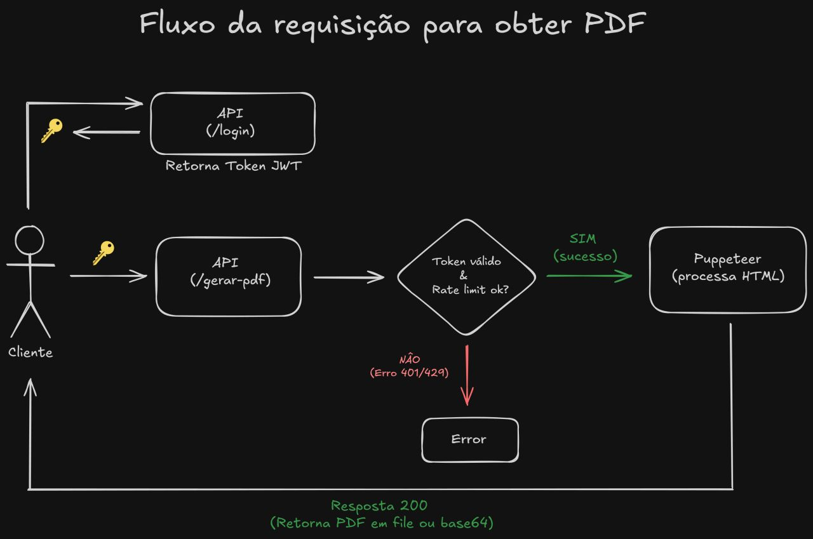

# HTML to PDF Converter API

A robust and secure Node.js microservice designed to convert raw HTML into high-quality PDF documents. This API was developed to resolve a specific technical hurdle for applications that require reliable, automated document generation.

## 🚀 Key Features

- **Headless Browser Rendering:** Utilizes Puppeteer to ensure PDFs are generated exactly as they would appear in a modern web browser.
- **Secure Access:** Implements JWT (JSON Web Token) authentication to restrict and secure endpoint access.
- **Rate Limiting:** Built-in protection to prevent API abuse and handle high traffic gracefully (HTTP 429).
- **Flexible Output:** Supports returning the generated document as a downloadable file stream or a Base64 encoded string, adapting to different front-end needs.

## 🏗️ Architecture & Request Flow

The application follows a secure and optimized request lifecycle to ensure performance and data integrity:

1. **Authentication (`/login`):** The client authenticates and receives a secure JWT token.
2. **Validation:** Requests to the `/gerar-pdf` endpoint are intercepted by middleware to validate the JWT and check the Rate Limit status. Invalid or excessive requests are blocked immediately (Errors 401/429).
3. **Processing:** Valid requests proceed to the Puppeteer engine for HTML parsing and PDF rendering.
4. **Response:** A successful HTTP 200 response delivers the PDF back to the client.



## 🛠️ Technologies Used

- **Node.js**
- **Puppeteer** (Headless Chrome Node API)
- **JWT** (JSON Web Tokens for Auth)
- **Express / Fastify** *(Ajuste aqui para o framework que você usou)*

## 🚦 Getting Started

### Prerequisites
- Node.js (v16+ recommended)
- npm or yarn

### Installation

1. Clone the repository:
   ```bash
   git clone https://github.com/tvgDev/api-pdf.git
   ```
2. Install the dependencies:
   ```bash
   npm install
   ```
3. Configure your environment variables (create a `.env` file based on `.env.example`):
   ```env
   JWT_SECRET=your_secret_key
   PORT=3000
   ```

### Running the API

```bash
npm start
# or for development:
npm run dev
```

## 💡 Use Case
This microservice is ideal for systems that need to generate dynamic invoices, reports, certificates, or any printable document directly from web application data, completely decoupling the heavy lifting of PDF generation from the main application servers.
